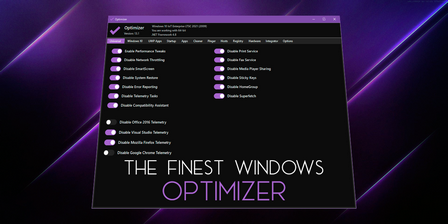

   

 

## Summary: ##

Portable utility that helps you restore your privacy and increase your security.

Optimizer is recommended after a fresh, clean installation of Windows to achieve maximum privacy and security.

Depending on your version of Windows, Optimizer will also allow you to perform some specific tweaks.

	

 

## Available in: ##

## Features: ##

* Speed up your system and network performance
* Disable unnecessary Windows services
* Disable Windows telemetry
* Disable Office telemetry (works only with Office 2016)
* Disable Cortana
* Disable Windows 10 automatic updates
* Download useful apps quickly at once
* Uninstall UWP apps
* Clean your system drive
* Fix common registry issues
* Ping IPs and assess your latency
* Search IPs on SHODAN.io
* Flush DNS cache
* Remove unwanted programs running at startup
* Edit your HOSTS file
* Add items in desktop on right-click menu
* Define custom commands for run dialog
* Silent run support using a configuration file

## Downloads: ##
https://github.com/hellzerg/optimizer/releases

## Screenshots: ##
https://github.com/hellzerg/optimizer/blob/master/IMAGES.md

## Silent configuration files: ##
https://github.com/hellzerg/optimizer/blob/master/CONFS.md

## Changelog: ##
https://github.com/hellzerg/optimizer/blob/master/CHANGELOG.md

## Early developmental images: ##
https://github.com/hellzerg/optimizer/blob/master/LEGACY.md

## Compatibility: ##

* .NET Framework 4.5.2
* Compatible with Windows 7, 8, 8.1, 10
* Can run under Windows Server 2008, 2012, 2016, 2019 using /unsafe switch

## Tools used: ##
* ByteSize from https://github.com/omar/ByteSize
* Thanks for this really tiny, yet extremely useful library

## Thanks to: ##
* aplenaki for Hellenic translation
* https://github.com/mrkaban - mrkaban for Russian translation
* https://github.com/theflamehd - theflamehd for German translation
* https://github.com/Kheasyque - Kheasyque for Turkish translation
* https://github.com/danielcshn - danielcshn for Spanish translation
* Cassio for Portuguese translation

## How to include an app in Common Apps - Pull Request
https://github.com/hellzerg/optimizer/blob/master/FEED.md

## Details: ##

* Latest version: 9.7
* Released: August 2, 2021
* SHA256: C50C88DC2FC610803A99FCAC2D4216D2CC9D3B3323C11FD3D70D2653D4552293
